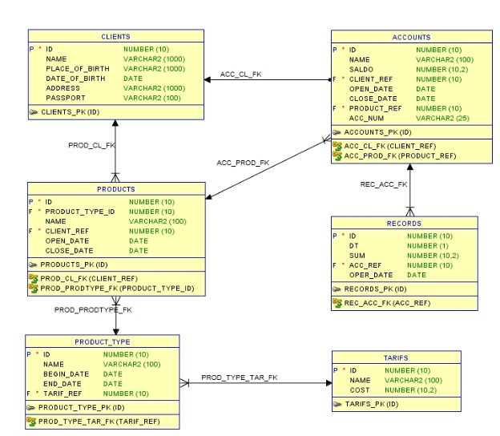



**Курс «Разработка баз данных» - Тестовое задание** 

Ниже представлена упрощенная модель учета операций в Банке. 



**Описание модели.** 

1. [CLIENTS] – таблица содержит основную информацию по клиентам Банка: ID – уникальный идентификатор (первичный ключ); 

NAME – ФИО клиента; 

PLACE\_OF\_BIRTH – место рождения клиента; 

DATE\_OF\_BIRTH – дата рождения клиента; 

ADDRESS – адрес проживания клиента; 

PASSPORT – паспортные данные клиента; 

2. [PRODUCTS] – таблица содержит информацию о продуктах, открытых для клиента в Банке: ID – уникальный идентификатор (первичный ключ); 

PRODUCT\_TYPE\_ID – ссылка на тип продукта; 

NAME – наименование продукта; 

CLIENT\_REF – ссылка на клиента; 

OPEN\_DATE – дата открытия продукта; 

CLOSE\_DATE – дата закрытия продукта; 

3. [PRODUCT\_TYPE] -  таблица содержит информацию о типах продуктов, которые доступны для открытия клиенту: 

ID – уникальный идентификатор (первичный ключ); 

NAME – наименование типа продукта; 

BEGIN\_DATE – дата начала действия типа продукта; 

END\_DATE – дата окончания действия типа продукта; 

TARIF\_REF – ссылка на тариф; 

4. [ACCOUNTS] -  таблица содержит информацию о счетах, открытых для клиента в Банке: 

ID – уникальный идентификатор (первичный ключ); 

NAME – наименование счета; 

SALDO – остаток по счету; 

CLIENT\_REF – ссылка на клиента; 

OPEN\_DATE – дата открытия счета; 

CLOSE\_DATE – дата закрытия счета; 

PRODUCT\_REF – ссылка на продукт, в рамках которого открыт счет; 

ACC\_NUM – номер счета. 

5. [RECORDS] – таблица содержит информацию операциях по счетам: 

ID – уникальный идентификатор (первичный ключ); 

DT – признак дебетования счета, может принимать значения 1 и 0, в случае когда значение равно 1 – остаток по счету уменьшается (дебет), в случае когда значение равно 0 – остаток по счету увеличивается (кредит); 

ACC\_REF – ссылка на счет, по которому происходит движение; 

OPER\_DATE – дата операции; 

SUM – сумма операции; 

6. [TARIFS] – таблица содержит информацию о тарифах за операции по счетам: 

ID – уникальный идентификатор (первичный ключ); 

NAME – наименование тарифа; 

COST – сумма тарифа. 

**Описание процесса.** 

Обслуживание клиента в банке начинается с заведения карточки клиента (таблица CLIENTS), далее клиент  выражает  завести  тот  или  иной  продукт  в  банке  -   КРЕДИТ,  ДЕПОЗИТ,  КАРТА  (таблица PRODUCT\_TYPE). После оформления документов в банке создается экземпляр продукта (таблица PRODUCTS),  в  рамках  продукта  открывается  один  или  несколько  счетов  (таблица  ACCOUNTS)  с остатком равным 0. 

Далее  в  случае,  если  оформлен  продукт  типа  КРЕДИТ  по  счету  продукта  проходит  дебетовая операция – банк выдает деньги клиенту (в таблице RECORDS появляется запись с полем DT = 1 и суммой зачисления, запись в таблице RECORDS влияет на поле SALDO таблицы ACCOUNTS). Если оформлен продукт ДЕПОЗИТ или КАРТА по счету клиента проходит кредитовая операция – клиент вносит  средства  на  счета  (в  таблице  RECORDS  появляется  запись  с  полем  DT  =  0  и  суммой зачисления, запись в таблице RECORDS влияет на поле SALDO таблицы ACCOUNTS). 

После чего клиент в случае, если ему открыт продукт типа КРЕДИТ, вносит средства на счет, погашая кредит, а если продукт типа ДЕПОЗИТ или КАРТА, может списывать средства со счета. После полного погашения продукта типа КРЕДИТ, выдача кредита может происходить снова, и клиент нужно опять осуществлять погашения. Если у клиента продукта типа ДЕПОЗИТ или КАРТА, клиент в любое время может внести средства. 

**Задания.** 

1. Подготовьте DDL-скрипты создания объектов для приведённой модели: создание таблиц, первичных, уникальных, внешних ключей и т.д. 
1. Заполните таблицы примерами из скрипта, приведенного в конце этого документа. 
1. Подготовьте скрипты заполнения таблиц тестовыми данными, достаточными для выполнения заданий ниже. 
1. Сформируйте выборку, которая содержит все счета, относящиеся к продуктам типа ДЕПОЗИТ, принадлежащих клиентам, у которых нет открытых продуктов типа КРЕДИТ. 
1. Сформируйте выборку, которая выведет сумму движений по счетам (дебетовые и кредитовые) в рамках одного произвольного дня, в разрезе типа продукта. 
1. Сформируйте выборку, в которую попадут клиенты, у которых были операции по счетам за прошедший месяц от текущей даты. Выведите клиента и сумму дебетовых операций за день в разрезе даты. 
1. В результате сбоя в базе данных разъехалась информация между остатками и операциями по счетам. Напишите нормализацию (процедуру выравнивающую данные), которая найдет такие счета и восстановит остатки по счету. 
1. Сформируйте выборку, которая содержит информацию о клиентах, которые полностью погасили кредит, но при этом не закрыли продукт. 
1. Закройте продукты (установите дату закрытия равную текущей) типа КРЕДИТ, у которых произошло полное погашение, но при этом не было повторной выдачи. 
1. Закройте возможность открытия (установите дату окончания действия) для типов продуктов, по счетам продуктов которых, не было движений более одного месяца. 
1. В модель данных добавьте сумму договора по продукту. Заполните поле для всех продуктов суммой максимальной дебетовой операции по счету для продукта типа КРЕДИТ, и суммой максимальной кредитовой операции по счету продукта для продукта типа ДЕПОЗИТ или КАРТА. 

Примечание. Порядковый номер задач не связан с их сложностью. Для решения указанных задач могут потребоваться различные навыки и уровень знаний SQL, поэтому допустимо их частичное решение. Предлагается выполнить задания, какие и как можете. Используйте СУБД ORACLE. Для выполнения задания можно использовать сервис[ sqlize.online ](https://sqlize.online/sql/oracle21/aa4988462299a5afd3310c8b202d082e/?ysclid=m4av4l1k3c393281931)или любой подобный. 

Спасибо за ваши решения. Удачи и до встречи на курсе! ☺ 

Скрипт заполнения таблиц 

begin  
```
insert into tarifs values (1,'Тариф за выдачу кредита', 10);  insert into tarifs values (2,'Тариф за открытие счета', 10);  insert into tarifs values (3,'Тариф за обслуживание карты', 10); 
```
insert into productype values (1, 'КРЕДИТ', to\_date('01.01.2018','DD.MM.YYYY'), null, 1); insert into productype values (2, 'ДЕПОЗИТ', to\_date('01.01.2018','DD.MM.YYYY'), null, 2); insert into productype values (3, 'КАРТА', to\_date('01.01.2018','DD.MM.YYYY'), null, 3); 

insert into clients values (1, 'Сидоров Иван Петрович', 'Россия, Московская облать, г. Пушкин', to\_date('01.01.2001','DD.MM.YYYY'), 'Россия, Московская облать, г. Пушкин, ул. Грибоедова, д. 5', '2222 555555, выдан ОВД г. Пушкин, 10.01.2015'); 

insert into clients values (2, 'Иванов Петр Сидорович', 'Россия, Московская облать, г. Клин', to\_date('01.01.2001','DD.MM.YYYY'), 'Россия, Московская облать, г. Клин, ул. Мясникова, д. 3', '4444 666666, выдан ОВД г. Клин, 10.01.2015'); 

insert into clients values (3, 'Петров Сиодр Иванович', 'Россия, Московская облать, г. Балашиха', to\_date('01.01.2001','DD.MM.YYYY'), 'Россия, Московская облать, г. Балашиха, ул. Пушкина, д. 7', '4444 666666, выдан ОВД г. Клин, 10.01.2015'); 

insert into products values (1, 1, 'Кредитный договор с Сидоровым И.П.', 1, to\_date('01.06.2015','DD.MM.YYYY'), null); insert into products values (2, 2, 'Депозитный договор с Ивановым П.С.', 2, to\_date('01.08.2017','DD.MM.YYYY'), null); insert into products values (3, 3, 'Карточный договор с Петровым С.И.', 3, to\_date('01.08.2017','DD.MM.YYYY'), null); 

insert into accounts values (1, 'Кредитный счет для Сидоровым И.П.', -2000, 1, to\_date('01.06.2015','DD.MM.YYYY'), null, 1, '45502810401020000022'); 

insert into accounts values (2, 'Депозитный счет для Ивановым П.С.', 6000, 2, to\_date('01.08.2017','DD.MM.YYYY'), null, 2, '42301810400000000001'); 

insert into accounts values (3, 'Карточный счет для Петровым С.И.', 8000, 3, to\_date('01.08.2017','DD.MM.YYYY'), null, 3, '40817810700000000001'); 

insert into records values (1, 1, 5000, 1, to\_date('01.06.2015','DD.MM.YYYY')); insert into records values (2, 0, 1000, 1, to\_date('01.07.2015','DD.MM.YYYY')); insert into records values (3, 0, 2000, 1, to\_date('01.08.2015','DD.MM.YYYY')); insert into records values (4, 0, 3000, 1, to\_date('01.09.2015','DD.MM.YYYY')); insert into records values (5, 1, 5000, 1, to\_date('01.10.2015','DD.MM.YYYY')); insert into records values (6, 0, 3000, 1, to\_date('01.10.2015','DD.MM.YYYY')); 

insert into records values (7, 0, 10000, 2, to\_date('01.08.2017','DD.MM.YYYY')); insert into records values (8, 1, 1000, 2, to\_date('05.08.2017','DD.MM.YYYY')); insert into records values (9, 1, 2000, 2, to\_date('21.09.2017','DD.MM.YYYY')); insert into records values (10, 1, 5000, 2, to\_date('24.10.2017','DD.MM.YYYY')); insert into records values (11, 0, 6000, 2, to\_date('26.11.2017','DD.MM.YYYY')); 

insert into records values (12, 0, 120000, 3, to\_date('08.09.2017','DD.MM.YYYY')); insert into records values (13, 1, 1000, 3, to\_date('05.10.2017','DD.MM.YYYY')); insert into records values (14, 1, 2000, 3, to\_date('21.10.2017','DD.MM.YYYY')); insert into records values (15, 1, 5000, 3, to\_date('24.10.2017','DD.MM.YYYY')); 

commit; end; 
